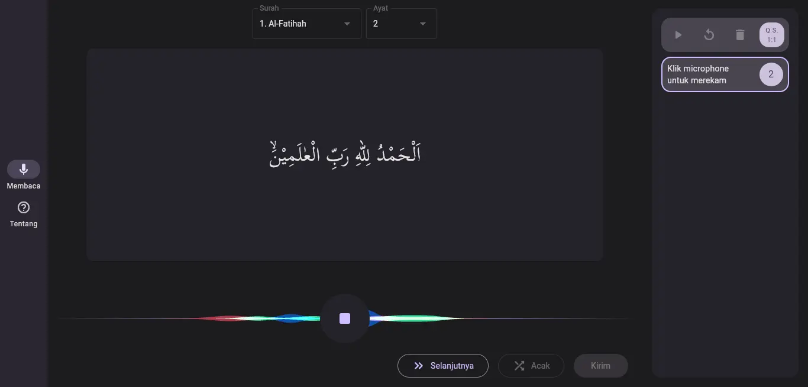

# Murojaah Web

![coverage][coverage_badge]
[![style: very good analysis][very_good_analysis_badge]][very_good_analysis_link]
[![License: MIT][license_badge]][license_link]

Murojaah Web is a web to collect dataset for Murojaah-ml.

## Abstract
This research aims to make it easier to memorize the Koran without having to need other people. Memorizers of the Koran (hafiz) often need other people to memorize them to find out if there are errors in their reading. Therefore, this research utilizes machine learning technology to make it easier to read and memorize the Al-Qur'an using the Convolutional Neural Network (CNN) algorithm. CNN was chosen because it is very good at classifying images and audio and can learn and extract features from raw data, such as image and audio data automatically. As a result, the model created succeeded in distinguishing one verse from another very well. The validation results show that the model can correctly detect 57 verses from 64 recorded data, which means it has an accuracy rate of 89.06%. With this verse classification model, it can then be implemented into an application to help memorize the Al-Qur'an even without using the internet.

## Read full paper [here](https://doi.org/10.15575/kjrt.v1i2.235)

## The model can be found [here](https://github.com/azliR/murojaah-ml)

## Demo
### Recite

Recite page when user is reciting.

### Listen

### About

[coverage_badge]: coverage_badge.svg
[flutter_localizations_link]: https://api.flutter.dev/flutter/flutter_localizations/flutter_localizations-library.html
[internationalization_link]: https://flutter.dev/docs/development/accessibility-and-localization/internationalization
[license_badge]: https://img.shields.io/badge/license-MIT-blue.svg
[license_link]: https://opensource.org/licenses/MIT
[very_good_analysis_badge]: https://img.shields.io/badge/style-very_good_analysis-B22C89.svg
[very_good_analysis_link]: https://pub.dev/packages/very_good_analysis
[very_good_cli_link]: https://github.com/VeryGoodOpenSource/very_good_cli
